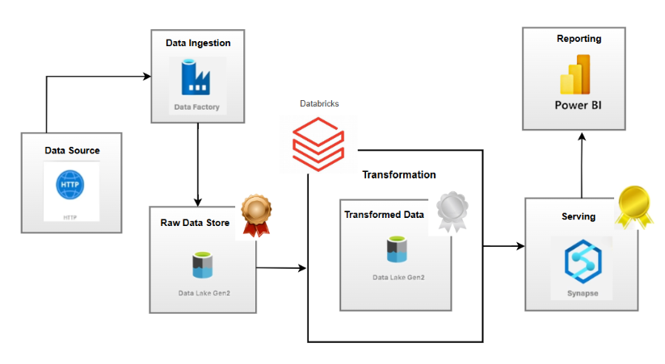

🚀 Azure Data Engineering Project: End-to-End ETL Pipeline
---
This project demonstrates a complete ETL pipeline using Microsoft Azure services, based on the Medallion Architecture (Bronze → Silver → Gold). The goal was to implement data engineering best practices by implementing real-world data engineering concepts using the Azure ecosystem.

🎯 Project Objective  
---
To implement a scalable Azure-based data pipeline that:

* Ingests structured data from GitHub
* Cleans and transforms the raw data using Databricks (PySpark)
* Stores data in a structured format across Medallion Architecture layers in Data Lake(Bronze, Silver, Gold)
* Enables analytical access through Synapse Serverless SQL and visualization via Power BI

🧬 Architecture Overview
---

                ┌──────────────────────────────┐
                │ External API Source (GitHub) │
                └────────────┬─────────────────┘
                             │
                             ▼
                 ┌────────────────────────┐
                 │  Azure Data Factory    │
                 │      (ADF)             │
                 └────────────┬───────────┘
                              │
                              ▼
          ┌────────────────────────────────────────────┐
          │      Azure Data Lake Storage Gen2          │
          │  ┌────────────┬────────────┬────────────┐  │
          │  │ Bronze     │ Silver     │ Gold       │  │
          │  │ Layer      │ Layer      │ Layer      │  │
          │  └────────────┴────────────┴────────────┘  │
          └────────────────────────┬───────────────────┘
                                   │
                                   ▼
                        ┌──────────────────────┐
                        │ Azure Databricks     │
                        │    (PySpark)         │
                        └────────┬─────────────┘
                                 │
                                 ▼
                        ┌──────────────────────┐
                        │ Azure Synapse        │
                        │ Analytics (SQL Pools)│
                        └────────┬─────────────┘
                                 │
                                 ▼
                        ┌──────────────────────┐
                        │    Power BI          │
                        │   Dashboard          │
                        └──────────────────────┘

🛠️ Tools & Technologies
---

| 🧰 Tool/Service             | 🔍 Purpose                                                        |
|----------------------------|-------------------------------------------------------------------|
| Azure Data Factory         | Data ingestion from GitHub to DataLake (CSV to ADLS Gen2 - Bronze)|
| Azure Data Lake Gen2       | Structured storage for Bronze, Silver, and Gold layers            |
| Azure Databricks           | Data cleaning and transformation using PySpark                   |
| PySpark                    | Distributed data processing in Databricks                        |
| Azure Synapse Serverless SQL | Expose external tables and views for querying                    |
| Power BI                   | Data visualization and reporting from Synapse                    |
---

<h2>🗃️ Project Breakdown </h2>
<h3>🔁 Data Pipeline Stages   </h3>

1️⃣ Data Ingestion (Bronze Layer)  

* Azure Data Factory was used to ingest raw CSV files from a public GitHub repository and store them in Azure Data Lake Storage Gen2.
* Each file was saved in its original format within a structured folder hierarchy, without any modifications.

2️⃣ Data Transformation (Silver Layer)
* Established secure connection between Azure Data Lake and Databricks using Microsoft Entra ID (App ID, Secret, Tenant ID).
* Loaded multiple CSVs (Product, Customer, Sales, Returns) into Databricks.
* Used PySpark to clean, filter, and transform the raw data.
* Stored the output data into a Silver container in cleaned  and structured format.

3️⃣ Data Serving (Gold Layer)  

* External tables were created in Azure Synapse Analytics using the OPENROWSET function to access the cleaned data from the Silver layer. 
* Loaded transformed data into these external tables for optimized querying and reporting access

4️⃣ Reporting (Power BI) 

* Established a connection between Synapse Analytics Power BI.
* Built a real-time, interactive dashboard to visualize the final business insights. 

<h2> 🎓 Key Learnings </h2>

* Gained hands-on experience with the Medallion Architecture (Bronze, Silver, Gold layers) to build scalable and maintainable data pipelines.
* Learned how to integrate Azure services securely using Managed Identities and Service Principals for seamless authentication.
* Implemented strategies for handling incremental data loads, ensuring efficient and scalable ETL processes.
* Explored query performance optimization in Azure Synapse by leveraging external tables and views for large datasets.
* Developed skills in designing interactive Power BI dashboards to communicate data-driven insights effectively.

<h2> 🔗 Resources </h2>

* [Azure Data Factory Documentation](https://learn.microsoft.com/en-us/azure/data-factory/)
* [Azure Databricks Quickstart](https://learn.microsoft.com/en-us/azure/databricks/)
* [Delta Lake Guide](https://delta.io/)
* [Synapse Analytics Overview](https://learn.microsoft.com/en-us/azure/synapse-analytics/)
* [Power BI Docs](https://learn.microsoft.com/en-us/power-bi/)

<h2>📬 Contact</h2>
If you have any questions, ideas, or want to collaborate — feel free to connect!

Author: Ramya V  
LinkedIn: [Ramya V](https://www.linkedin.com/in/ramya703/)

